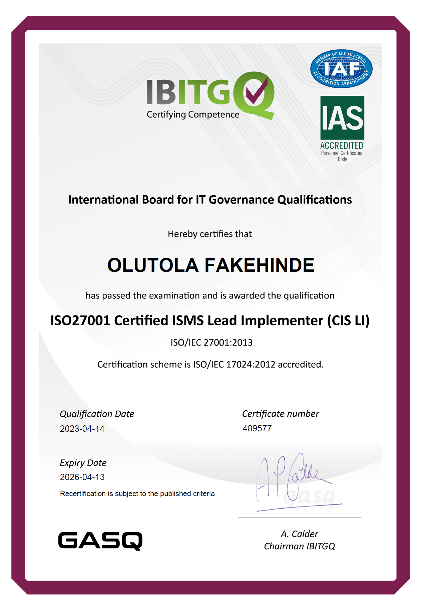

# Cyber-Security

## Introduction

Information Security Management System (ISMS) consists of the policies, procedures, guidlines, and associated resources and activities, collectively managed by an organisztion, in the pursuit of potecting its information assets.

An ISMS is a systematic approach for establishing, implementing, operating, monitoring, reviewing, maintaining and improving an organisation's information security to achieve business objectives.

## ISO 27001 Structure
The structure of Information Security Management System is:
1. Context
2. Leadership
3. Planning
4. Support
5. Operation
6. Evaluation
7. Improvement

## Data Security
My knowledge in Cyber Security informed my of the importance of data security in data analysis. Data Security, which is also known as data protection in analytics and business intelligence involves organisation's policies, processes and technologies for the protection of the organisation's assets against data breaches or threats within and outside the organisation.

## Conclusion
No matter the form of data approach, a business/data analyst must not downplay the importance of security, governance and confidentiality of the data one uses.

## Reference
1. ISO 27001 Certified ISMS Lead Implementer (CIS) v2.1.1.1 (Distance Learning)

2. What is Data Security? [link](https://www.yellowfinbi.com/blog/what-is-data-security#Where_do_I_start_with_data_security_for_my_analytics_users)
